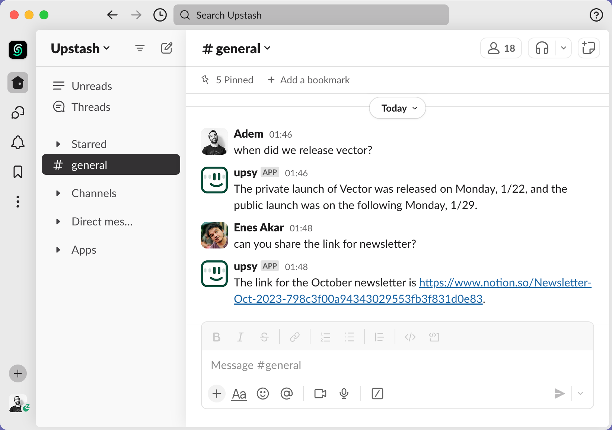
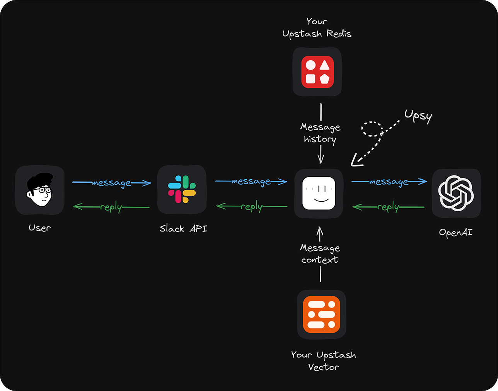
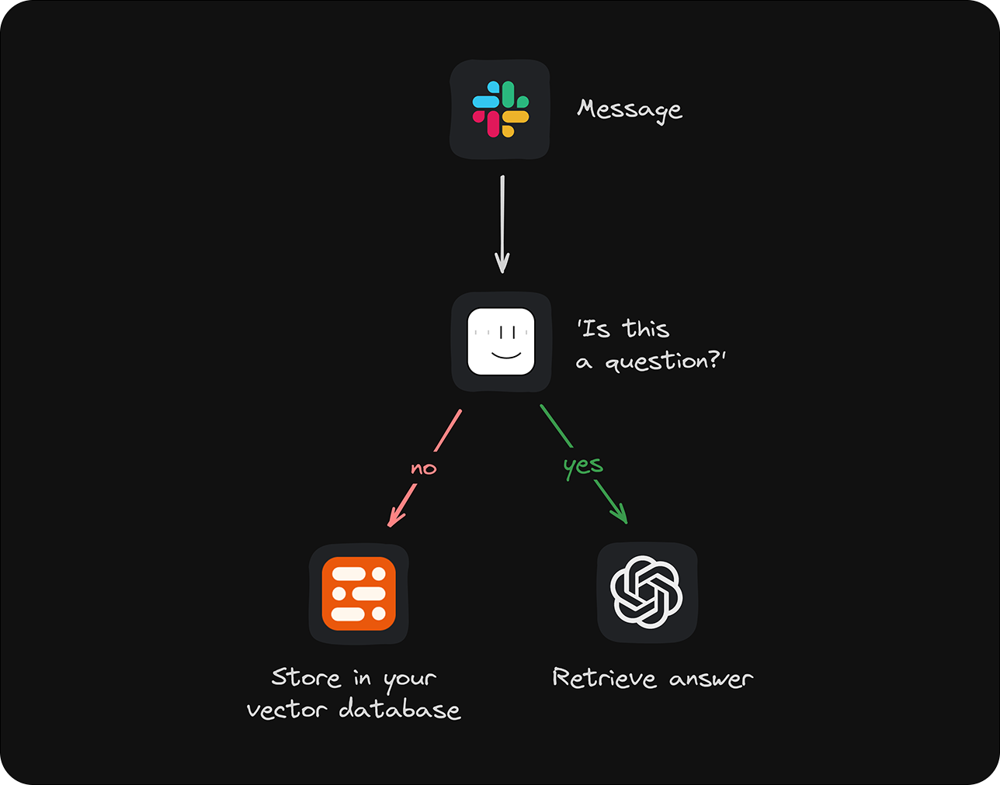

# Upsy: Your new mate on Discord & Slack. Powered by AI.


> [!NOTE]  
> **This project is a Community Project.**
>
> The project is maintained and supported by the community. Upstash may contribute but does not officially support or assume responsibility for it.

Upsy is an open source Discord & Slack bot that remembers your conversations to provide **fast, accurate answers whenever you have a question**.

## Demo: 

[Discord Bot Link](https://discord.com/oauth2/authorize?client_id=1220739209321644033) You can add Upsy to your Discord server and it can answer questions based on the chat history.

> :warning: **Warning:** This is a public bot and the data you share with Upsy could be accessed by others. We recommend deploying your own instance of Upsy for private conversations.





## Table of Contents

1. [Tech Stack](#user-content-upsys-defaults)
2. [Features](#user-content-features)
3. [Setup](#user-content-setup)
4. [Testing](#user-content-testing)
5. [Troubleshooting](#user-content-troubleshooting)
6. [How Upsy Works](#user-content-how-upsy-works)
7. [Development](#user-content-development)
8. [Contributing](#user-content-contributing)


## Tech Stack

We've chosen the following tech stack because it works reliably out of the box. Because of the modular design, you can completely customize any part of Upsy to fit your needs.

- Backend: **Node.js**
- AI Integration: **OpenAI API**
- Data Storage: **[Upstash Vector](https://upstash.com/docs/vector/overall/whatisvector) & [Upstash Redis](https://upstash.com/docs/redis/overall/getstarted)**
- LLM Orchestration: **[Langchain](https://langchain.com)**
- Deployment Option: **[Fly.io](https://fly.io)**


## Features

No matter how old or buried within a channel the answer to your question might be, Upsy will find relevant messages from its memory and respond immediately and only if it's sure of the answer. Upsy stores only data you explicitly allow it to process by adding it to specific channels and stores all data in your own database.

**🧠 Unified Memory:** Upsy's memory works across channels you've added Upsy to. Get to-the-point answers even if the corresponding information is buried deep within another channel.

**🔒 Privacy Preserved:** Upsy only accesses data from the channel you add it to. It is open source and self-hosted. The communication between the Upsy server, Discord and Slack is encrypted.

**⌚ Works Retrospectively:** Add Upsy to any channel, and it will store the channel history in its memory. The bot jumps in only if someone asks a question it can find a relevant answer to or if someone mentions Upsy in their message.

**💡 Add Data via DMs:** Communicate with Upsy via Direct Messages (DMs). You can even add new information to Upsy’s memory by interacting in DMs that it can then use to answer questions in any other channel.


## Setup

### 1. Getting Started

To get started, you'll need an [OpenAI](https://openai.com), [Fly](https://fly.io/), [Upstash](https://console.upstash.com), [Discord](https://discord.com/register) and [Slack](https://slack.com/get-started#/createnew) accounts. After signing in to Upstash, create one Redis and one Vector database - these will later contain your Slack data. Unless you change the default configuration, choose a dimension of 1536 for your Upstash Vector database. Simply creating these databases is enough for now; we'll get back to this step in the setup.


## Discord Setup

### Create a Discord Application

Create an application at “https://discord.com/developers/applications".

### Privileged Gateway Intents

To enable the bot to access the message history, you need to enable the `Privileged Gateway Intents`. Go to the `Bot` section of your Discord application and enable the `MESSAGE CONTENT INTENT ` and `SERVER MEMBERS INTENT`.

### Default Install Settings 

After choosing Install Link (Settings > Installation) as Discord provided link, you need to update scopes and permissions under Default Install Settings as follows:

Scopes: applications.commands, bot

Bot Permissions: Send Messages, Read Message History, Use Slash Commands, Add Reactions, Embed Links, Read Messages/View Channels, Send Messages in Threads, Use External Emojis, Send TTS Messages.


### Get your Bot Token
Reset token in the bot section of your Discord application.
Your token should start with "MTIzMz…"

### Put your token into config/config.json file

```json
{
    "client": {
        "token": "MTIzMz...",
    },
} 
```
### Get your Application ID and put it into config/config.json file

You can find your application ID in the General Information section of your Discord application. 

```json
{
    "client": {
		    "id":"123333333333333333",
        "token": "MTIzMz...",
    },
} 
```

### Set the environment variables either in Dockerfile or fly.toml:

```properties
OPENAI_API_KEY=""
UPSTASH_REDIS_REST_TOKEN=""
UPSTASH_REDIS_REST_URL=""
UPSTASH_VECTOR_REST_TOKEN=""
UPSTASH_VECTOR_REST_URL=""
```

### You can either run the bot locally or deploy it to Fly.io

#### Local Deployment

```bash
docker build -f discord/Dockerfile -t upsy-discord .
docker run -d -p 3001:3001 upsy-discord
```

#### Fly.io Deployment

```bash
fly launch
fly deploy
```

Don't forget to run `fly scale count 1` to make sure only one instance is running.


### Add the bot to your Discord server

To add the bot to your Discord server, you need to generate an OAuth2 URL. Go to the Installation section of your Discord application and under Install Link, select the discord provided link. You can then add the bot to your server.

At this point, you should see the bot online in your Discord server.

### Notes:

Your initial discord commands will be registered at docker build time.
For deleting, updating or adding new commands, you need to run `npm run commands:*` commands.

Discord template used in this project is:  [Discord-Bot-TypeScript-Template](https://github.com/KevinNovak/Discord-Bot-TypeScript-Template)

## Slack Setup

To create a new Slack app in your team account, go to https://api.slack.com/apps, click `Create New App`, then select `from an app manifest`. After selecting your workspace, copy and paste the below configuration into the JSON editor:

<details>
<summary>App manifest</summary>

```json
{
  "display_information": {
    "name": "upsy",
    "description": "Your new mate on Slack. Powered by AI.",
    "background_color": "#000000"
  },
  "features": {
    "bot_user": {
      "display_name": "upsy",
      "always_online": true
    }
  },
  "oauth_config": {
    "scopes": {
      "bot": [
        "app_mentions:read",
        "channels:history",
        "channels:join",
        "channels:read",
        "chat:write",
        "groups:history",
        "im:history",
        "im:read",
        "im:write",
        "im:write.invites",
        "mpim:history",
        "reactions:read",
        "reactions:write",
        "users:read",
        "groups:read",
        "mpim:read",
        "files:read"
      ]
    }
  },
  "settings": {
    "event_subscriptions": {
      "request_url": "https://example.com/",
      "bot_events": [
        "member_joined_channel",
        "member_left_channel",
        "message.channels",
        "message.groups",
        "message.im",
        "message.mpim"
      ]
    },
    "org_deploy_enabled": false,
    "socket_mode_enabled": false,
    "token_rotation_enabled": false
  }
}
```
</details>


#### Click on `Create`.

After clicking on Create:

- Go to OAuth & Permissions in the App dashboard
- Click `Install to Workspace` and install.

One last step is to enable Upsy for direct messages. Go to your `Features` > `App Home` and set the checkbox for "Allow users to send Slash commands and messages from the messages tab".

Congratulations, you've created your Slack app! 🎉 Keep this dashboard open because we'll need the generated Slack tokens in the next step.

### 3. Backend Deployment

The backend is a simple Node application that runs Slack's Bolt SDK. We will deploy it on Fly, but it can be hosted anywhere that supports Node.

#### 3.1. Local Deployment

Clone the Upsy repository:

```bash
git clone git@github.com:upstash/upsy.git
cd upsy/slack
```

Set the environment variables either in Dockerfile or fly.toml:

```properties
OPENAI_API_KEY=""
UPSTASH_REDIS_REST_TOKEN=""
UPSTASH_REDIS_REST_URL=""
UPSTASH_VECTOR_REST_TOKEN=""
UPSTASH_VECTOR_REST_URL=""
SLACK_ACCESS_TOKEN=""
SLACK_SIGNING_SECRET=""
SLACK_APP_TOKEN=""
```

Run the following commands to start the server:

```bash
docker build -f slack/Dockerfile -t upsy-slack .
docker run -d -p 3000:3000 upsy-slack
```

Update the Request URL in the Slack dashboard (Features > Event Subscriptions) to point to your local server, you can use ngrok to expose your local server to the internet.

example: `https://your-ngrok-url/slack/events`

#### 3.2. Fly.io Deployment

Clone the Upsy repository:

```bash
git clone git@github.com:upstash/upsy.git
cd upsy/slack
```

Edit the environment variables either in Dockerfile or fly.toml:

```properties
# Retrieved here: https://platform.openai.com/api-keys
OPENAI_API_KEY=

# Retrieved here: https://console.upstash.com/   
UPSTASH_REDIS_REST_URL=
UPSTASH_REDIS_REST_TOKEN=

# Retrieved here: https://console.upstash.com/vector
UPSTASH_VECTOR_REST_URL=
UPSTASH_VECTOR_REST_TOKEN=

# Retrieved from the Slack dashboard we just created. 
# SLACK_ACCESS_TOKEN should start with xoxb-.  `Features > OAuth & Permissions`
# SLACK_SIGNING_SECRET  `Settings > Basic Information`
# SLACK_APP_TOKEN should start with xapp-. `Settings > Basic Information > App-Level Tokens`
SLACK_ACCESS_TOKEN=
SLACK_SIGNING_SECRET=
SLACK_APP_TOKEN=
```

First create a Fly app by running `fly launch`. Say `Yes` to the question `Would you like to copy its configuration to the new app?`

Deploy your app to Fly.io by running the below command:

```bash
fly deploy
```

Once we deployed our project, Fly will give us the URL for this deployment. Copy the URL of your Fly app, i.e., https://your-upsy.fly.dev and head to your Slack dashboard. Find the `Features > Event Subscriptions` menu on the sidebar and enter the URL  appending 'slack/events' to  Request URL input field in Slack. The final result looks like this:

`https://your-upsy.fly.dev/slack/events`

and you should see the message `Verified` on Slack dashboard.

Fly.io allows you to see runtime logs in case you're curious about what Upsy is doing under the hood when a message on Slack comes in! Simply run:

```bash
fly logs
```
Now we are ready to test Upsy!

<details>
<summary>
<h2>Testing</h2>
</summary>

Once you complete the deployment step, you can install it to your Slack workspace. If Upsy looks unresponsive check the troubleshooting section below.

The simplest way to test the integration is by asking Upsy questions via direct messages or adding it to a channel with prior messages. It'll jump into the conversation to answer questions if it's confident in the answer or will respond if you mention it directly.

> 🔥 **Pro Tip**
>
> Once you add Upsy to a channel or send it a direct message, check your Upstash Vector data browser. You should see the data appearing here.

In addition to keeping a long history of the entire chat to draw answers from, Upsy also keeps a short-term memory to provide fast, accurate responses to recent chat topics. Test this by messaging a number and then ask to increment that number :)

Because we've built Upsy to work cross-channel with unified memory, you can always add additional information via direct messages, which it then uses to answer questions in channels and vice-versa.
</details>


<details>
<summary>
<h2>Troubleshooting</h2>
</summary>

**DM Issues:** If you see "Sending messages to this app has been turned off" in the DM screen of Upsy, try restarting your Slack. If that doesn't resolve the issue, you can remove Upsy from your workspace, reinstall it, and approve the requested scopes.

**Non-responsiveness:** If Upsy appears online but does not answer back:

- Check the runtime logs in the Fly.io.
- Verify that your Slack token and signing keys are correct

**Memory not working:**
If Upsy answers but is not aware of the channel history to answer your questions:
- Verify that Upsy has indexed the chat history via the Upstash Vector dashboard, where you should see this data appearing
- Check the runtime logs on the Fly.io after adding it to a channel; you should see logs indicating that the indexing process has started

**Fly deployment issue**
If the `fly deploy` command looks stuck, try `fly deploy --local-only` which builds the image locally then push it to the fly.

</details>


<details>
<summary>
<h2>How Upsy Works</h2>
</summary>

Upsy is an open-source project. You have complete control over the code, and all information Upsy retrieves is stored securely in your own Upstash database. We've chosen convenient defaults that work great out of the box, but the code is fully customizable for you to tailor Upsy to your needs. Here's an overview of **how it works under the hood**:



<br/>
<br/>

And here's how Upsy knows which messages to store and which ones to answer:


</details>


<details>
<summary>
<h2>Development</h2>
</summary>

> 🔥 **Pro Tip**
>
> Enable the `Socket mode` in your Slack dashboard. This mode allows your app to use the Events API without exposing a public HTTP Request URL.

To get started in development for a Fly.io deployment, use the root folder:

```bash
   npm install
   node index.js
```
</details>


<details>
<summary>
<h2>Contributing</h2>
</summary>

Upsy is a work in progress, so we'll add more features and improve the current ones. We've collected a few ideas we believe would make Upsy an even more helpful companion:

- Add documents to the context so that Upsy can memorize and use them as context.
- Add a web interface to manage Upsy so you can add new information to Upsy’s memory via the web interface and configure Upsy’s behavior
- More proactive Upsy - Upsy will initiate conversations with you or respond to welcome, birthday, etc. messages
- Ability to choose personal characters for Upsy, such as friendlier, funnier, or more serious

If one of these ideas sounds like something you'd like to work on, contributions are very welcome! You can contribute by adding new features, fixing bugs, improving the documentation, writing blog posts, or by sharing Upsy on social media.
</details>
