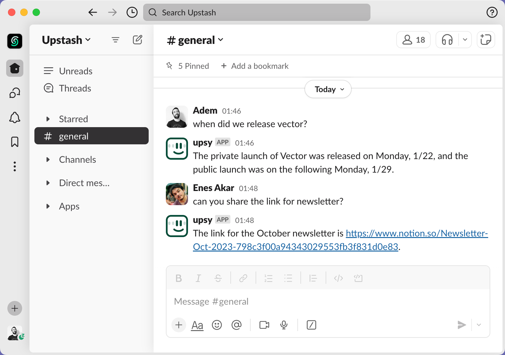

# Upsy: Your new mate on Slack. Powered by AI.

[](https://vercel.com/new/clone?repository-url=https%3A%2F%2Fgithub.com%2Fupstash%2Fupsy%2Ftree%2Fmaster%2Fupsy-next&env=OPENAI_API_KEY,UPSTASH_REDIS_REST_URL,UPSTASH_REDIS_REST_TOKEN,QSTASH_TOKEN,QSTASH_NEXT_SIGNING_KEY,QSTASH_CURRENT_SIGNING_KEY,UPSTASH_VECTOR_REST_URL,UPSTASH_VECTOR_REST_TOKEN,SLACK_ACCESS_TOKEN,SLACK_SIGNING_SECRET&project-name=upsy&repository-name=upsy)

Upsy is an open-source Slack bot that remembers your conversations to provide **fast, accurate answers whenever you have a question**. No matter how old or buried within a channel the answer to your question might be, Upsy will find relevant messages from its memory and respond immediately and only if it's sure of the answer. Upsy stores only data you explicitly allow it to process by adding it to specific channels and stores all data in your own database.



## Features

**🧠 Unified Memory:** Upsy's memory works across channels you've added Upsy to. Get to-the-point answers even if the corresponding information is buried deep within another channel.

**⌚ Works retrospectively:** Add Upsy to any channel, and it will store the channel history in its memory. The bot jumps in only if someone asks a question it can find a relevant answer to or if someone mentions Upsy in their message.

**💡 Add data via DMs:** Communicate with Upsy via Direct Messages (DMs). You can even add new information to Upsy’s memory by interacting in DMs that it can then use to answer questions in any other channel.

## How Upsy works

Upsy is an open-source project. You have complete control over the code, and all information Upsy retrieves is stored securely in your own Upstash database. We've chosen convenient defaults that work great out of the box, but the code is fully customizable for you to tailor Upsy to your needs. Here's an overview of how it works:


## Upsy's defaults

We've chosen the following tech stack because it works reliably out of the box. Because of the modular design, you can completely customize any part of Upsy to fit your needs.

**Backend:** Node.js ([Fly.io](https://fly.io) version), Next.js ([Vercel](https://vercel.com) version)

**AI Integration:** OpenAI API

**Data Storage:** Upstash Vector & Upstash Redis

**LLM Orchestration:** [Langchain](https://langchain.com)

**Deployment Options:** [Fly.io](https://fly.io), [Vercel](https://vercel.com)

# Creating your own Upsy

## 1 - Getting Started

To get started, you'll need an [OpenAI](https://openai.com) account and an [Upstash](https://console.upstash.com) account. After signing in to Upstash, create one Redis and one Vector database - these will later contain your Slack data. Unless you change the default configuration, choose a dimension of 1536 for your Upstash Vector database. Simply creating these databases is enough for now; we'll get back to this step in the setup.

## 2 - Slack Setup

To create a new Slack app in your team account, go to https://api.slack.com/apps, click `Create New App`, then select `from an app manifest`. After selecting your workspace, copy and paste the below configuration into the JSON editor:

```json
{
  "display_information": {
    "name": "upsy",
    "description": "Your new mate on Slack. Powered by AI.",
    "background_color": "#000000"
  },
  "features": {
    "bot_user": {
      "display_name": "upsy",
      "always_online": true
    }
  },
  "oauth_config": {
    "scopes": {
      "bot": [
        "app_mentions:read",
        "channels:history",
        "channels:join",
        "channels:read",
        "chat:write",
        "groups:history",
        "im:history",
        "im:read",
        "im:write",
        "im:write.invites",
        "mpim:history",
        "reactions:read",
        "reactions:write",
        "users:read",
        "groups:read",
        "mpim:read"
      ]
    }
  },
  "settings": {
    "event_subscriptions": {
      "request_url": "https://example.com/",
      "bot_events": [
        "member_joined_channel",
        "member_left_channel",
        "message.channels",
        "message.groups",
        "message.im",
        "message.mpim"
      ]
    },
    "org_deploy_enabled": false,
    "socket_mode_enabled": false,
    "token_rotation_enabled": false
  }
}
```

Click on `Create`.

After clicking on Create:

- go to OAuth & Permissions in the App dashboard
- click `Install to Workspace` and install

Congratulations, you've created your Slack app! 🎉 Keep this dashboard open because we'll need the generated Slack tokens in the next step.

## 3 - Backend Deployment

We have two options for hosting our application: Fly.io or Vercel. This decision comes down to personal preference and if you already have experience with either one. Both are simple, and we can get set up and running in minutes.

### 3.1 - Vercel Deployment

You can deploy Upsy to Vercel in about two clicks by using the following button:

[](https://vercel.com/new/clone?repository-url=https%3A%2F%2Fgithub.com%2Fupstash%2Fupsy%2Ftree%2Fmaster%2Fupsy-next&env=OPENAI_API_KEY,UPSTASH_REDIS_REST_URL,UPSTASH_REDIS_REST_TOKEN,QSTASH_TOKEN,QSTASH_NEXT_SIGNING_KEY,QSTASH_CURRENT_SIGNING_KEY,UPSTASH_VECTOR_REST_URL,UPSTASH_VECTOR_REST_TOKEN,SLACK_ACCESS_TOKEN,SLACK_SIGNING_SECRET&project-name=upsy&repository-name=upsy)

For the deployment to work, set the following environment variables in your Vercel dashboard under `Settings > Environment Variables`:

```properties
# Retrieved here: https://platform.openai.com/api-keys
OPENAI_API_KEY=

# Retrieved here: https://console.upstash.com/
UPSTASH_REDIS_REST_URL=
UPSTASH_REDIS_REST_TOKEN=

# Retrieved here: https://console.upstash.com/qstash
QSTASH_TOKEN=
QSTASH_CURRENT_SIGNING_KEY=
QSTASH_NEXT_SIGNING_KEY=

# Retrieved here: https://console.upstash.com/vector
UPSTASH_VECTOR_REST_URL=
UPSTASH_VECTOR_REST_TOKEN=

# Retrieved from the Slack dashboard we just created
# SLACK_ACCESS_TOKEN is the bot user OAuth token
SLACK_ACCESS_TOKEN=
SLACK_SIGNING_SECRET=

# Your Vercel app url - we'll add this after deployment
APP_URL=
```

> [!NOTE]  
> We know entering so many env variables is not very convenient. We will soon improve this so it only requires a single token. 👀

Now, let's hit the big `Deploy` button on Vercel. Once we deployed our project, Vercel will give us the URL for this deployment. Copy this URL, i.e., `https://your-upsy.vercel.app` and head to your Slack dashboard. For the `Request URL input` in Slack, enter this Vercel domain and append `/api/event` to it. The final result looks like this:

`https://your-upsy.vercel.app/api/event`

Lastly, add your deployment URL as the `APP_URL` environment variable to Vercel and redeploy.

> 🔥 **Pro Tip**
>
> Vercel allows you to see runtime logs in case you're curious about what Upsy is doing under the hood when a message on Slack comes in!

 

### 3.1 - Fly.io Deployment

Clone the Upsy repository:

```bash
git clone git@github.com:upstash/upsy.git
```

Rename `fly.toml.example` to `fly.toml` and set the environment variables correctly.

```properties

[env]
# Retrieved here: https://platform.openai.com/api-keys
OPENAI_API_KEY=

# Retrieved here: https://console.upstash.com/
UPSTASH_REDIS_REST_URL=
UPSTASH_REDIS_REST_TOKEN=

# Retrieved here: https://console.upstash.com/vector
UPSTASH_VECTOR_REST_URL=
UPSTASH_VECTOR_REST_TOKEN=

# Retrieved from the Slack dashboard we just created
SLACK_ACCESS_TOKEN= -> Bot User OAuth Token
SLACK_SIGNING_SECRET=
```

Deploy your app to Fly.io by running the below command:

```bash
fly deploy
```

Just like Vercel, fly.io also allows you to see runtime logs in case you're curious about what Upsy is doing under the hood when a message on Slack comes in! Simply run:

```bash
fly logs
```

## 4 - Testing Upsy

The simplest way to test the integration is by asking Upsy questions via direct messages or adding it to a channel with prior messages. It'll jump into the conversation to answer questions if it's confident in the answer or will respond if you mention it directly.

> 🔥 **Pro Tip**
>
> Once you add Upsy to a channel or send it a direct message, check your Upstash Vector data browser. You should see the data appearing here.

In addition to keeping a long history of the entire chat to draw answers from, Upsy also keeps a short-term memory to provide fast, accurate responses to recent chat topics. Test this by messaging a number and then ask to increment that number :)

Because we've built Upsy to work cross-channel with unified memory, you can always add additional information via direct messages, which it then uses to answer questions in channels and vice-versa.

### Troubleshooting

**DM Issues:** If you see "Sending messages to this app has been turned off" in the DM screen of Upsy, try restarting your Slack. If that doesn't resolve the issue, you can remove Upsy from your workspace, reinstall it, and approve the requested scopes.

**Non-responsiveness:** If Upsy appears online but does not answer back:

- Check the runtime logs in Vercel or the Fly.io console
- If you deployed to Vercel, check the logs in the QStash console
- Verify that your Slack token and signing keys are correct

**Memory not working:**
If Upsy answers but is not aware of the channel history to answer your questions:

- Verify that Upsy has indexed the chat history via the Upstash Vector dashboard, where you should see this data appearing
- Check the runtime logs on Vercel or the Fly.io console after adding it to a channel; you should see logs indicating that the indexing process has started

### Development

> 🔥 **Pro Tip**
>
> Enable the `Socket mode` in your Slack dashboard. This mode allows your app to use the Events API without exposing a public HTTP Request URL.

To get started in development for a Fly.io deployment, use the root folder:

```bash
   npm install
   node index.js
```

If you plan to deploy to Vercel, use the `upsy-next` folder for development:

```bash
   cd upsy-next
   npm install
   npm run dev
```

## Future Work and Contributing

Upsy is a work in progress, so we'll add more features and improve the current ones. We've collected a few ideas we believe would make Upsy an even more helpful companion:

- Add documents to the context so that Upsy can memorize and use them as context.

- Add a web interface to manage Upsy so you can add new information to Upsy’s memory via the web interface and configure Upsy’s behavior

- More proactive Upsy - Upsy will initiate conversations with you or respond to welcome, birthday, etc. messages

- Ability to choose personal characters for Upsy, such as friendlier, funnier, or more serious

If one of these ideas sounds like something you'd like to work on, contributions are very welcome! You can contribute by adding new features, fixing bugs, improving the documentation, writing blog posts, or by sharing Upsy on social media.
